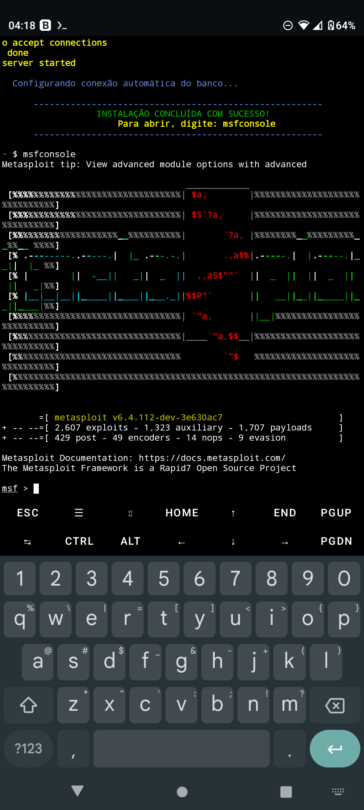

<p align="center">
  
</p>

# Metasploit Framework Installer for Termux (Ruby 3.4.0 Fix)


Este script automatiza a instalação completa do **Metasploit Framework** no Termux. O diferencial deste instalador é a correção do erro crítico de compilação da Gem **Nokogiri** e outras extensões nativas que surgiram com a atualização do **Ruby 3.4.0**.

## O que este script resolve?
Recentemente, a atualização do Ruby para a versão 3.4.0 quebrou a instalação de várias extensões em C. Este script aplica um **patch direto nos headers do Ruby** (`rbasic.h`), removendo a restrição de `const` que impede a compilação correta no ambiente Android/Termux, permitindo que o Nokogiri seja instalado sem falhas.

##  Funcionalidades
-  **Limpeza Automática:** Remove vestígios de instalações anteriores ou quebradas.
-  **Nokogiri & Ruby Patch:** Aplica a correção no arquivo `rbasic.h` automaticamente.
-  **Database Ready:** Configura o PostgreSQL e o banco de dados `msf_db` sem erros.
-  **Performance:** Utiliza clones rasos para um download muito mais veloz.
-  **Interface Cyber:** Banner centralizado e colorido (By Cyber).

##  Como Instalar

Copie e cole o comando abaixo no seu Termux:
```bash
pkg install wget -y && wget -q -O msf_install.sh https://raw.githubusercontent.com/qrt2/msf-termux-ruby34/main/msf_install.sh && chmod +x msf_install.sh && ./msf_install.sh
```

 Requisitos
​Termux: Atualizado via pkg update.

​Espaço: Aproximadamente 1.5GB de memória livre

​Internet: Conexão estável para baixar as Gems.

​ ​Desenvolvido por: Cyber.

​Contato: t.me/cybe4

​Foco: Resolver problemas de compatibilidade da 
comunidade Termux-Hacking.

## Projetos que utilizam esta correção / Ecosystem Adoption

Este patch foi integrado com sucesso a grandes instaladores automatizados da comunidade para garantir a compatibilidade do Metasploit com o Ruby 3.4.0 no Termux.

* **[Willie169/metasploit_in_termux](https://github.com/Willie169/metasploit_in_termux)**: Integrou esta correção de cabeçalho para restabelecer os testes automatizados de CI/CD (GitHub Actions) em arquiteturas `arm` e `aarch64`.

Se você precisa de um script de instalação completo que gerencie todas as dependências adicionais (como SQLite3 e Bundler), recomendamos utilizar o fork mantido por eles.


​<!-- end list -->
